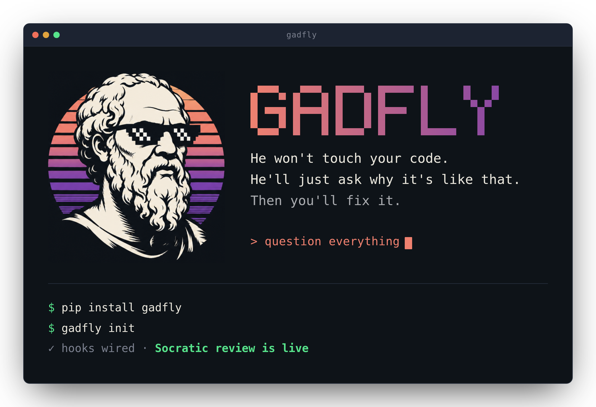
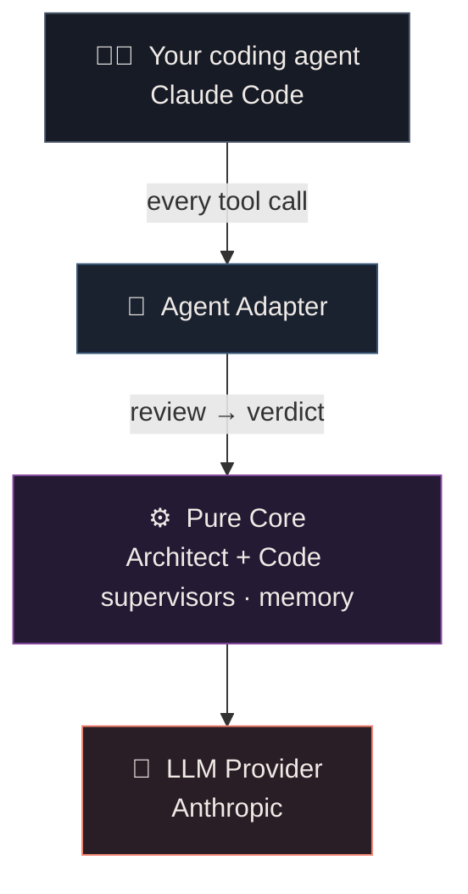

<div align="center">



**A Socratic supervision layer for AI coding agents.**

*“I am that gadfly which the god has given the state and all day long and in all places*
*am always fastening upon you, arousing and persuading and reproaching you.”*
— Socrates, in Plato's *Apology*

[](LICENSE)
[](pyproject.toml)
[](pyproject.toml)
[](https://claude.com/claude-code)

</div>

---

Gadfly sits inside your coding agent's live tool-call loop and does what Socrates did to
Athens: it **questions every consequential move *before* it happens.** It grounds the work in
your vision, catches drift and real bugs pre-execution, surfaces the decisions that actually
matter, and learns your preferences as it goes — so you can stay at altitude instead of
babysitting a diff.

## Gadfly in action

| When your agent… | Gadfly… |
|---|---|
| makes a safe, routine change | ✅ **allows** it — silently |
| drifts from what you asked | 💬 **questions** it, mid-flight |
| writes a real bug | ⛔ **blocks** it before it runs |
| makes a big call your spec never settled | ✋ **surfaces** it to you |

*Four verdicts, checked on every tool call — all before anything executes. Gadfly stays quiet
when the work is on track, and speaks only when it matters.*

## The problem

An AI coding agent makes dozens of consequential decisions in a single session — a data
model, an auth strategy, a dependency, an edge case, a quiet deviation from what you asked
for. Almost none of them surface to you. You're left with two bad options:

- **Micromanage** every step — which defeats the entire point of an agent, or
- **Trust blindly** — and let drift, silent design choices, and latent bugs pile up.

Gadfly is the third option: it holds the human-in-the-loop seat *for* you, so the agent
stays honest without you reading every line.

## How it works

At every tool call — **before it executes** (`PreToolUse`) — Gadfly reviews the action with
two independent, read-only supervisors. A deterministic first pass auto-allows reads and safe
commands for free, so the LLMs only wake for things that matter. Each review returns one of
four verdicts:

| Verdict | What it means |
|---|---|
| ✅ **allow** | silent, stays out of your way — the common case |
| 💬 **question** | a pointed note back to the builder that makes it reconsider, mid-flight |
| ✋ **surface** | pauses and asks *you*, for a genuinely consequential, undiscussed call |
| ⛔ **block** | stops an action that violates your spec or carries a real bug |

## Why you'll want it

- **Fewer keystrokes, higher altitude.** Gadfly replaces the human-in-the-loop role *as
  much as you want* — supervising, gating, and deciding on your behalf. You engage through
  surfaced questions, not constant approvals.
- **Nothing consequential slips by silently.** Every consequential decision the agent would
  otherwise make quietly is caught the moment it's made — grounded in your spec, surfaced
  to you, or at minimum logged. Nothing unjustified goes unlogged.
- **Bugs caught *before* they run.** A skeptical code reviewer flags real logic errors,
  edge cases, broken contracts, and hallucinated APIs at the gate — not in a post-hoc review
  after they've already landed.
- **Stays true to your vision.** An architectural supervisor, loyal to *your* spec, catches
  drift and quiet betrayals of intent — the agent satisfying the letter while missing the point.
- **It learns you.** Correct the agent's code and Gadfly notices: an idle-time loop distills
  your out-of-band edits into durable rules, so the same correction never has to happen
  twice. It calibrates to your style and gets sharper the more you use it.
- **Socratic, not bureaucratic.** Its sharpest tool is the question, not the decree — it
  asks the thing that makes the builder find the flaw itself, and reserves hard blocks for
  when they're truly warranted. High denial rates aren't the goal; good questions are.

## The two supervisors

Two separate, isolated reviews — never merged, so one can't bias the other:

- **🏛️ The Architect** *(default: Opus)* — a Socratic visionary loyal to your vision.
  Reads code *as a language*, to grasp what's being built and why. Catches drift from the
  spec, inconsistency with the realized structure, and undiscussed decisions with lasting
  consequences. Questions first; asserts only when a question won't do.
- **🔬 The Code Reviewer** *(default: Sonnet)* — a logic skeptic. Real defects only: wrong
  conditions, unhandled edges, races, leaks, broken invariants, misused or invented APIs.
  Signal over noise — silent on correct code.

Prefer to run lean? A **cover-for-other** mode lets a single model act as sole supervisor,
covering both lanes through a purpose-written prompt variant.

## It improves itself

Gadfly keeps a private, append-only **edit-ledger** of every change the agent makes. When
you edit that code out of band — the classic *“no, do it **this** way”* — Gadfly diffs your
version against the agent's and hands it to a separate, idle-time extractor that decides
whether the correction *generalizes*. Worthy patterns become durable memory:

- project-specific rules land in the supervised project's `claude.md`,
- cross-project style preferences land in your global memory.

All of it off the hot path, conservative by design (usually it saves nothing), and never
blocking the build. **Your calibration writes itself.**

## Grounded in your intent

Gadfly reasons from a small, layered memory of the supervised project rather than guessing:

| File | Owner | Role |
|---|---|---|
| `spec.md` | **You** — *required* | The vision the architect enforces against, every gate |
| `claude.md` | **You** — *optional* | Project rules, enforced when present |
| `codemap.md` | Builder | A live map of the current structure |
| `decisions.md` | Gadfly | A ledger of load-bearing decisions and why they were made |
| `memory.md` | Gadfly | Your cross-project style and calibration |

A light pre-build **midwife** pass reads your `spec.md` on the first prompt and asks the sharp
questions it leaves unanswered — so you sharpen a real spec before building, not a vague one.

## Spec-driven development that actually holds

Most "spec-driven" workflows write a spec, then drift from it the moment coding starts — it
becomes a stale doc nobody enforces. Gadfly makes the spec **load-bearing**:

- `gadfly init` **requires** a `spec.md` — no vision, no supervision.
- The architect measures **every** edit against it — in letter *and* spirit — and catches
  drift the moment it starts, not in review three hours later.
- Consequential calls your spec never covered get surfaced to you, and once you accept one it's
  promoted back into the spec — so it stays the living source of truth, not a fossil.

The spec you write is the spec that gets enforced, turn after turn.

## You set the altitude

An **autonomy dial** controls how often Gadfly involves you:

- **autonomous** — decides and logs almost everything; surfaces only the critical or irreversible
- **balanced** — surfaces the consequential, spec-silent, high-level calls; decides the rest
- **collaborative** — surfaces most consequential or conceptual decisions

Irreversible operations always ask, regardless of the dial.

## Architecture

A small, **pure core** wrapped by two adapter boundaries — one that speaks the host agent's
native format, one that speaks to an LLM provider. Both are swappable; the core is
agent-agnostic, LLM-agnostic, and owns its own normalized state.



See [`spec.md`](spec.md) for the full design.

## Quickstart *(v1: Claude Code)*

```bash
pip install git+https://github.com/Touchpoint-Labs/Gadfly.git   # zero deps; PyPI soon
cd your-project

# 1. Write a spec.md — it's required; the architect enforces against it. Sketch the project
#    with your AI assistant and save it as spec.md. (Optionally add a claude.md of rules.)

# 2. Wire Gadfly in — conflict-safe, leaves any hooks you already have.
gadfly init
gadfly status        # confirm it's live
```

Then code in Claude Code as usual. Gadfly rides your existing access — **no API key required.**

### Commands

| Command | |
|---|---|
| `gadfly init` | Wire hooks into this folder (a `spec.md` is required); `init global` targets `~/.claude` |
| `gadfly status` | Check the install is live — actually runs a hook end-to-end |
| `gadfly config` | Show, get, or set config in `gadfly.toml` (models, autonomy dial, review scope) |
| `gadfly disable` / `enable` | Pause / resume without touching your settings |
| `gadfly uninstall` | Remove Gadfly's hooks — leaves any of your own |

## License

[MIT](LICENSE) — © 2026 Touchpoint Labs.
